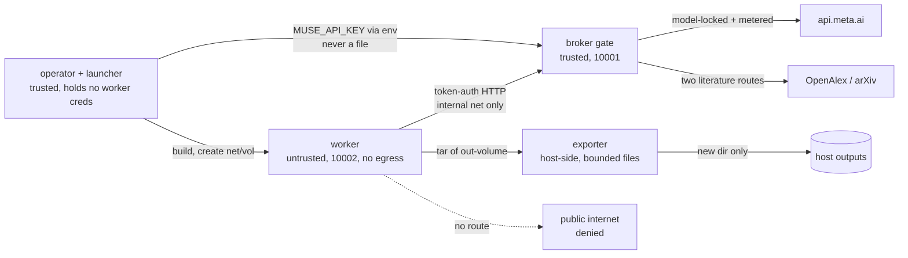

# Trust boundary: untrusted worker, trusted supervisor (Build 02)

Status: decided 2026-09-27. Implements issue #3. This is a containment
architecture decision, not an absolute guarantee (see Residual risks).

## Decision

Run untrusted worker code in **hardened Linux containers** launched by a
small trusted supervisor on the host. The worker gets no provider
credentials, no GitHub credentials, no host/home access, and no direct
network egress: every external call crosses the request broker
(`boundary/`, see `docs/TOKEN_BOUNDARY.md`), and every artefact leaves
through the constrained exporter (`scripts/export_bundle.py`).

Until Builds 03-04 deliver a launcher-attested execution path, **all
public revision entry points refuse** (`ContainmentBlocked`, tested in
`tests/test_trust_boundary.py`). No environment flag, `/.dockerenv`, or
container-mode string authorizes revision; the retired `CANARY_SANDBOXED`
marker is documented nowhere as evidence. Durable promotion happens only
through human-authored pull requests.

### Runtime comparison (smallest maintained runtime that meets the threat model)

| Option | Isolation | Verdict |
|---|---|---|
| Hardened container (chosen) | Namespaces, cgroups, dropped caps, read-only root, internal-only net | Smallest maintained runtime; matches current single-host threat model |
| gVisor / Kata microVM | Stronger syscall/kernel boundary | Revisit when workers handle sensitive data or get broader egress; today the operational weight buys little because workers hold no secrets |
| Dedicated VM per run | Full guest kernel | Rejected for now: image/provisioning weight, no maintained harness in this repo, same broker/export design still required |

The broker/export split is runtime-agnostic: moving to microVMs later
changes the launcher, not the trust split.

### Supported runtime

- Linux containers via Docker Engine 28+ with buildx. Validated on
  `ubuntu-latest` GitHub runners and local Docker 29.4 (arm64).
- Worker image `python:3.12-slim` + uv 0.9.13; Python 3.10-3.13 for the
  offline test suite. Base-image digest pinning is Build 04 work.
- macOS runs the offline suite only: no containment, no revision, no
  `/proc` clock. Anything trust-relevant executes on Linux.

## Threat model

- **Untrusted worker**: generated/experimental code. May read its
  disposable workspace and broker answers; may execute freely inside the
  guest as a non-root user. Must not reach the host, other runs, daemon
  APIs, credentials, or the raw provider.
- **Trusted launcher/supervisor** (`scripts/container_run.sh` + operator):
  owns Docker, networks, volumes, teardown. Never passes provider or
  GitHub credentials into the guest and never executes guest shell.
- **Credential broker** (`boundary/` + `scripts/gate_service.sh`): sole
  holder of `MUSE_API_KEY` and the persistent token ledger. Mediates one
  model route and two literature routes; nothing else.
- **Independent evaluation/promotion** (target: Builds 14-16): today this
  is the fail-closed gate plus human PR review. No in-worker auto-merge
  runs until the independent gate exists.
- **Artefact export** (`scripts/export_bundle.py`, host-side): copies
  bounded regular files from the out-volume into a new directory. Never
  executes, renders, or unpickles guest content.

### Capability matrix

| Capability | Worker (10002) | Broker (10001) | Launcher/export (host) |
|---|---|---|---|
| Read | Baked repo copy, `/work`, `/tmp`, broker replies | Ledger volume, provider + literature replies | Repo, images, out-volumes |
| Write | tmpfs `/tmp` (512M), `/work` (2G), out-volume | Ledger volume only | New export dirs, Docker state |
| Execute | Guest processes, pids ≤ 256 | `serve` entrypoint only | Launcher scripts, never guest shell |
| Contact | `canary-gate:8787` on internal net only | `api.meta.ai`, OpenAlex, arXiv | Docker daemon, registries |

Worker hard limits (externally enforced, guest cannot raise): `--user
10002:10002`, `--cap-drop ALL`, `no-new-privileges`, `--read-only`,
`--memory 4g`, `--cpus 2`, `--pids-limit 256`, internal-only network.

### Data flow

## Contract

- **Host/LAN/metadata**: worker network is internal-only; no host, LAN,
  link-local, metadata, or management endpoints are reachable, over IPv4
  or IPv6. Build 04 proves this against owned fixtures.
- **Daemon APIs**: no Docker/Podman socket, no host PID namespace, no
  privileged mode. The launcher never evaluates guest commands on the host.
- **Mounts**: no home, no `.git`, no SSH/cloud credentials, no arbitrary
  host paths. Writable mounts are tmpfs scratch plus one out-volume.
- **Local credentials**: provider key lives only in the broker process
  environment; the ledger and gate token live on a broker-only volume.
  Workers receive only the narrow gate token. No `GITHUB_TOKEN` in guests.
- **Untrusted text**: retrieved literature and model output are data, never
  executed. Export never loads pickle or renders active content.
- **Dependency installation**: guests cannot reach package registries
  directly today (no egress). Build 03 provides supported installation
  through reviewed broker routes or a vetted snapshot, not by restoring
  direct egress (see Network decision).
- **Resource exhaustion**: CPU/memory/pids/output caps are set outside the
  guest; wall-time stop/teardown is launcher-owned (Build 03). Export caps
  at 200 MB / 5000 files and refuses devices, links, traversal, and
  overwrite (`xb` create-only into a new `0700` directory).
- **Artefact extraction**: tar stream from the out-volume is re-validated
  file by file on the host; collisions and non-regular files abort.

## Guest-root justification

No guest workload runs as root: worker is `10002:10002`, broker is
`10001:10001`, both with `no-new-privileges`. The single root action is a
host-side `chown` of the fresh out-volume before the worker starts; it
touches only that volume and grants the guest no host privilege. Any
future guest-root need must be justified here before it ships.

## Network decision (explicit, not silent)

Issue #3 asked to preserve broad public-internet access. The newer,
reviewed token boundary (`docs/TOKEN_BOUNDARY.md`) deliberately removed
direct worker egress because model selection cannot be enforced for a
writable worker that can reach arbitrary endpoints. This decision record
adopts that narrowing explicitly:

- Direct worker egress stays **denied** (fail closed).
- Build 03 satisfies "public fetch and dependency installation work"
  through **reviewed, mediated broker routes** (e.g. allowlisted PyPI and
  public-HTTP fetch), each recorded with its data-exposure scope, or
  returns to the owner for an explicit alternative. Restoring raw egress
  requires compensating model-lock controls and owner approval.
- Public internet can carry any data exposed to the worker. Until broader
  routes exist, initial demos use only public/synthetic data and the two
  narrowly scoped literature services.

## In-process revision gate (what it is and is not)

`require_revision_trust()` refuses every public revision entry point
(`revise_round`, `revise_from_journal`, `publish_round`,
`commit_and_push`, `cycle --maintenance`, CLI `revise`) before any model
call, subprocess, or mutation, unless exactly one interim role marker is
present (Issue #52): `CANARY_GUEST=1`, injected only by
`scripts/container_run.sh` into disposable workers, or
`CANARY_PUBLISHER=1`, set only by the owner's publish driver on the
host. Both markers at once, or any other value, refuses. It is an
interlock against accidental uncontained execution, **not** a boundary
against malicious in-process code (in-process callers can monkeypatch
anything) or a forged guest (a marker is a claim, not proof). Tests use
the explicit monkeypatch seam plus genuine-path tests with markers set;
the container boundary in Builds 03-05 remains the real enforcement.

Deferred hardening, tracked, not claimed: an independent review
identity for auto-merge PRs (#62), safety properties governed by CI
from a repo the worker account cannot reach (#63), and a host-side
prod gate pinning the launch SHA to `origin/main` (#64).

## Run profiles: dev branches, prod on main

`--profile dev` (default) may run on any branch. `--profile prod`
refuses unless the worktree branch is `main`, and `publish` refuses
unless it cuts auto-branches from `main`, so bot PRs carry no foreign
commits. `main` itself is protected by a repo ruleset (PR-only, no
force pushes), so every code change lands through a PR with CI. These
are code-level checks against mistakes, not attestation: in-guest
claims about branches prove nothing, which is why #64 exists.

## Explicit exclusions

- No promise of perfect containment or kernel-escape immunity.
- No Kubernetes, no microservices platform, no manual approval per
  in-sandbox research action.
- No live revision, production credentials, auto-upload, or worker-driven
  Git push until containment validation (Builds 04-05) passes.
- Base-image digest pinning, seccomp profiles, and user-namespace
  remapping are future hardening, not current claims.

## Residual risks

Shared-kernel escapes, Docker daemon compromise, supply-chain drift in
floating base tags, broker bugs, operator error, and undisclosed provider
token use. The fail-closed gate plus human-reviewed promotion bounds
blast radius; it does not remove these risks.

## Acceptance checklists for the next two steps

### Build 03 (#4): disposable launcher with externally enforced limits

- [ ] A clean supported machine builds and runs a non-revision fixture
      through the launcher on documented prerequisites alone.
- [ ] Two runs get independent workspaces; guest edits touch neither the
      source checkout, another run, nor the supervisor (host sentinels).
- [ ] Brokered public fetch and a representative dependency installation
      work; host/LAN/metadata/IPv6/redirect variants fail closed.
- [ ] Launcher imports no candidate modules and evaluates no guest shell
      on the host; image digest and trusted config are recorded per run.
- [ ] Timeout/cancel kills the guest tree and releases all disposable
      resources; teardown is demonstrated, not assumed.

### Build 04 (#5): containment verification and safe export

- [ ] Scheduled suite records pass/fail per capability plus
      runtime/image/config hashes and residual risks, all outside the worker.
- [ ] An intentionally unsafe fixture is rejected, and the suite shows the
      checks catching the corresponding boundary failure.
- [ ] Host/repo sentinels unchanged; network probes target owned fixtures
      only, never unrelated host/LAN services.
- [ ] Malicious export fixtures (traversal, links, devices, bombs,
      collisions) are rejected; benign exports land with checksums.
- [ ] Missing runtime support or failed containment blocks
      revision-enabled execution instead of skipping the gate.
